# Contract, Behavior & Protocol Diagrams

> Visual specification for every component in the target architecture. Each component is shown with its **Contract** (interface), **Behavior** (rules), and **Protocol** (communication). See also: [Implementation Guide](implementation_guide.md) | [Contracts & Protocols](contracts_protocols.md)

---

## Overview — All Components at a Glance

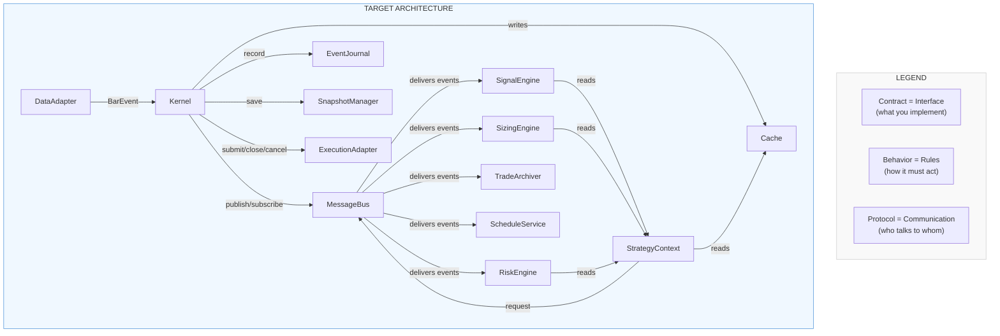

---

## 1. Cache

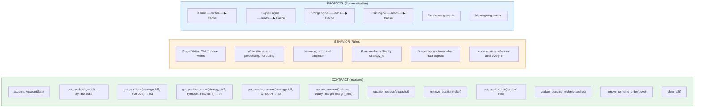

### Cache — Data Flow

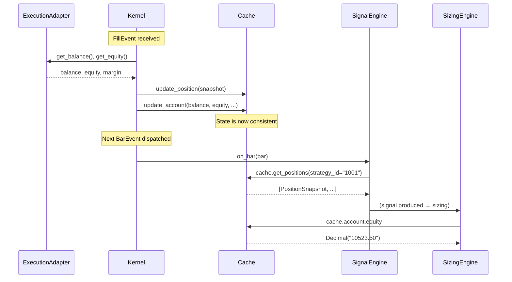

---

## 2. MessageBus

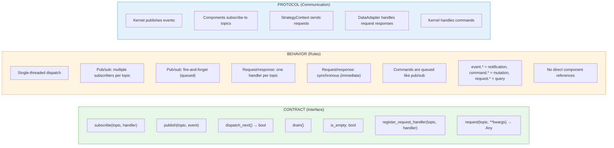

### MessageBus — Three Communication Patterns

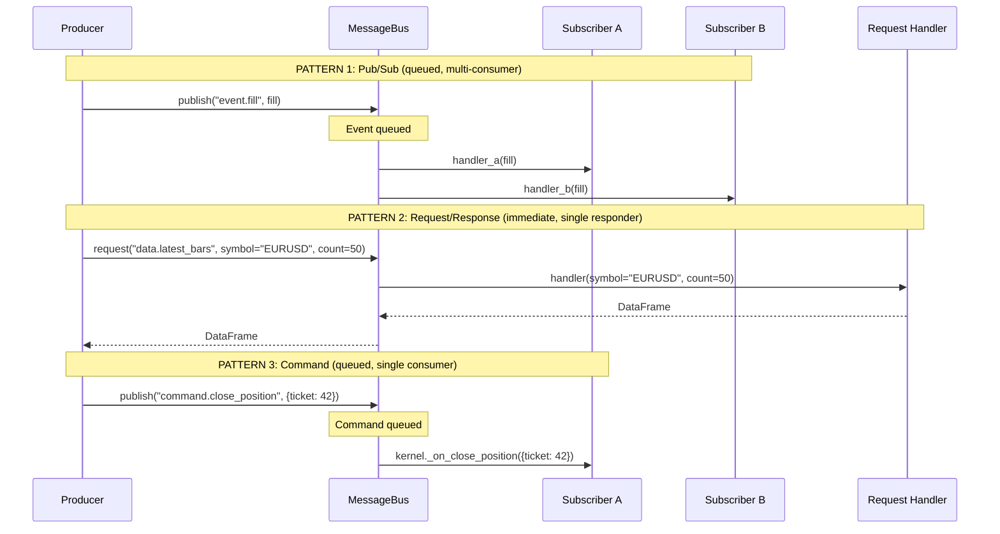

---

## 3. StrategyContext

```mermaid
graph LR
    subgraph CONTRACT["CONTRACT (Interface)"]
        direction TB
        C1["get_latest_bars(symbol, tf, count) → DataFrame"]
        C2["get_latest_tick(symbol) → dict"]
        C3["get_latest_bid(symbol) → Decimal"]
        C4["get_latest_ask(symbol) → Decimal"]
        C5["get_positions(symbol?) → list"]
        C6["get_position_count(symbol?, direction?) → int"]
        C7["get_pending_orders(symbol?) → list"]
        C8["get_account_balance() → Decimal"]
        C9["get_account_equity() → Decimal"]
        C10["close_position(ticket)"]
        C11["close_positions_by_symbol(symbol, direction?)"]
        C12["cancel_pending_order(ticket)"]
        C13["update_position_sl_tp(ticket, sl?, tp?)"]
    end

    subgraph BEHAVIOR["BEHAVIOR (Rules)"]
        direction TB
        B1["No direct references to other components"]
        B2["Data queries: synchronous via bus request"]
        B3["Portfolio queries: direct Cache read"]
        B4["Execution commands: async via bus publish"]
        B5["All queries scoped by strategy_id"]
    end

    subgraph PROTOCOL["PROTOCOL (Communication)"]
        direction TB
        P1["Data queries → bus.request() → DataAdapter"]
        P2["Portfolio queries → cache.get_*()"]
        P3["Execution commands → bus.publish(command.*)"]
    end

    style CONTRACT fill:#e8f5e9,stroke:#4caf50
    style BEHAVIOR fill:#fff3e0,stroke:#ff9800
    style PROTOCOL fill:#e3f2fd,stroke:#2196f3
```

### StrategyContext — Routing Diagram

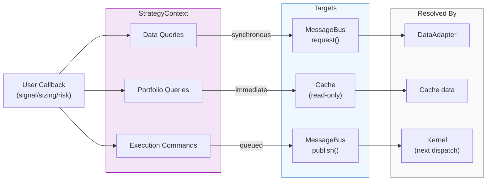

---

## 4. Execution Adapter

```mermaid
graph LR
    subgraph CONTRACT["CONTRACT (Interface)"]
        direction TB
        C1["connect() → bool"]
        C2["disconnect()"]
        C3["submit_market_order(symbol, direction, volume, sl?, tp?, strategy_id?) → AdapterOrderResult"]
        C4["submit_limit_order(symbol, direction, volume, price, sl?, tp?, strategy_id?) → AdapterOrderResult"]
        C5["submit_stop_order(symbol, direction, volume, price, sl?, tp?, strategy_id?) → AdapterOrderResult"]
        C6["cancel_order(ticket) → AdapterOrderResult"]
        C7["close_position(ticket) → AdapterOrderResult"]
        C8["modify_position(ticket, sl?, tp?) → AdapterOrderResult"]
        C9["get_balance() → Decimal"]
        C10["get_equity() → Decimal"]
        C11["get_used_margin() → Decimal"]
        C12["get_free_margin() → Decimal"]
        C13["get_open_positions(strategy_id?) → list"]
        C14["get_pending_orders(strategy_id?) → list"]
        C15["get_symbol_info(symbol) → dict"]
    end

    subgraph BEHAVIOR["BEHAVIOR (Rules)"]
        direction TB
        B1["Standardized results: always AdapterOrderResult"]
        B2["Lifecycle: connect() before use, disconnect() after"]
        B3["Margin validation before execution"]
        B4["Strategy isolation via strategy_id"]
        B5["No event emission — returns to Kernel only"]
        B6["Idempotent close: already-closed → success=False"]
    end

    subgraph PROTOCOL["PROTOCOL (Communication)"]
        direction TB
        P1["Kernel → submit/close/cancel → Adapter"]
        P2["Adapter → AdapterOrderResult → Kernel"]
        P3["Kernel is the ONLY caller"]
        P4["Adapter never touches Bus or Cache"]
    end

    style CONTRACT fill:#e8f5e9,stroke:#4caf50
    style BEHAVIOR fill:#fff3e0,stroke:#ff9800
    style PROTOCOL fill:#e3f2fd,stroke:#2196f3
```

### Execution Adapter — Implementations & Routing

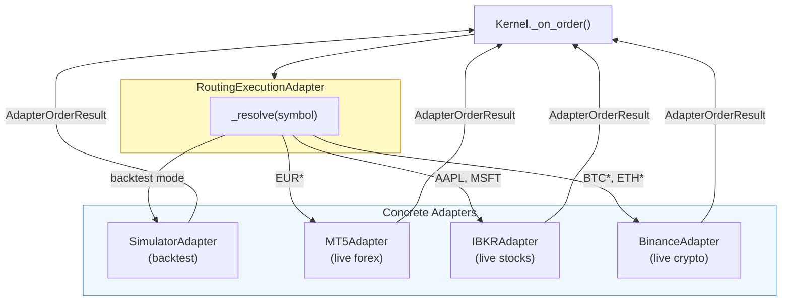

---

## 5. Data Adapter

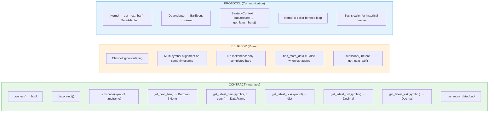

### Data Adapter — Implementations

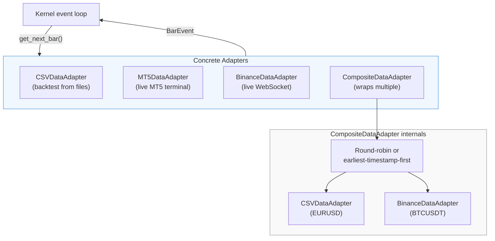

---

## 6. Event Journal & Snapshot Manager

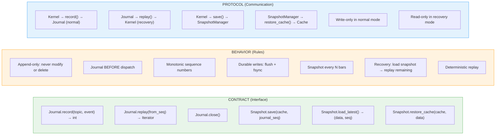

### Event Journal — Recovery Flow

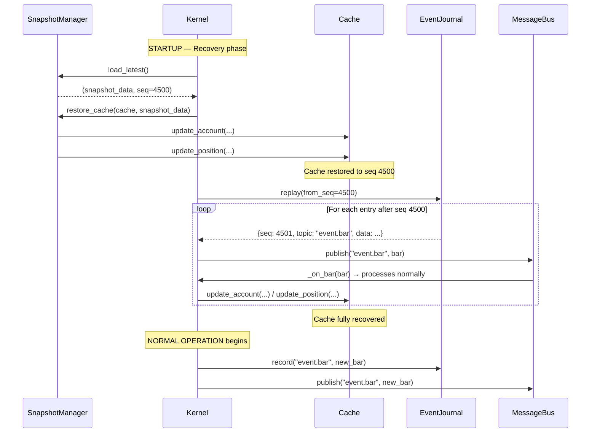

---

## 7. Kernel

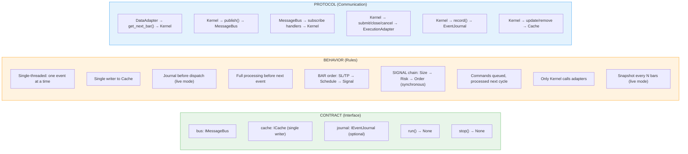

### Kernel — Full Event Flow

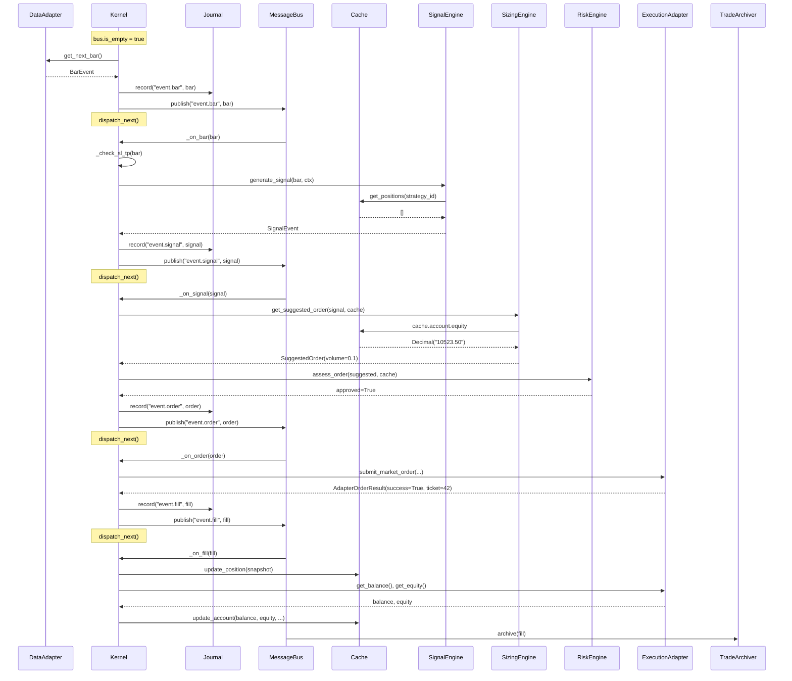

---

## 8. Signal Engine

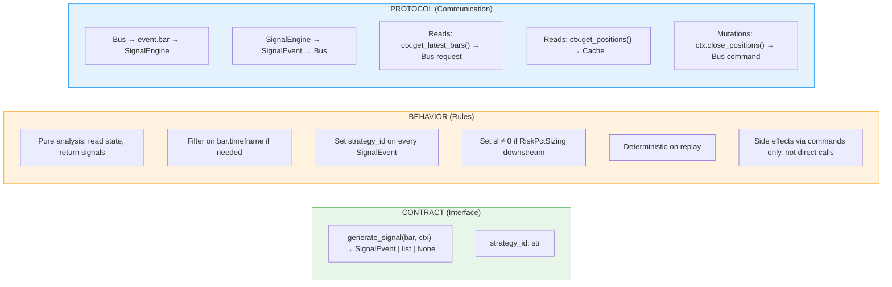

---

## 9. Sizing Engine

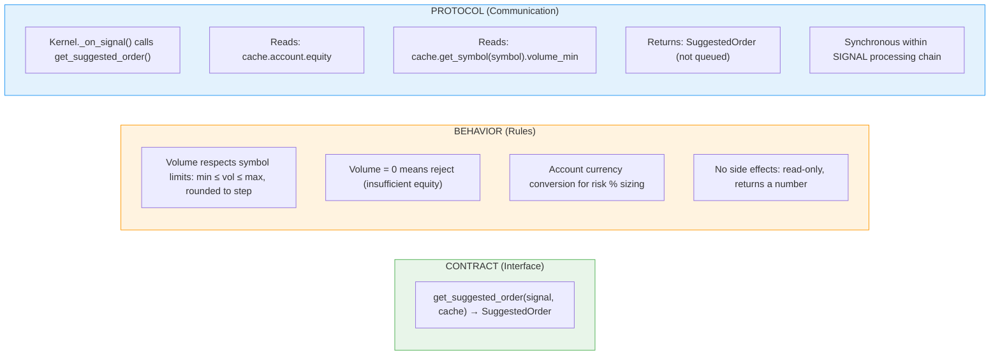

---

## 10. Risk Engine

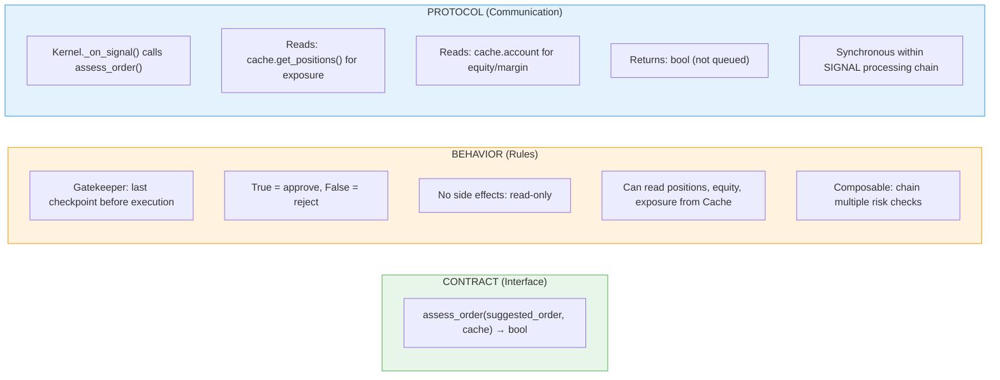

---

## 11. Trade Archiver

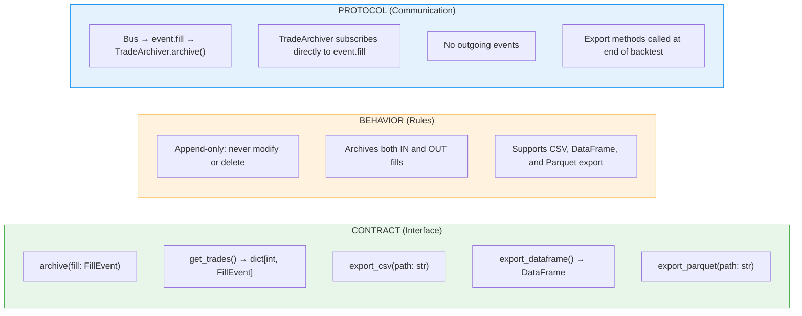

---

## 12. Schedule Service

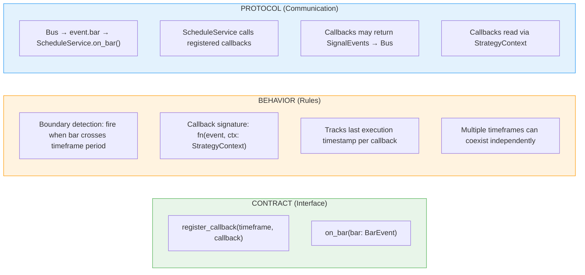

---

## 13. Full System — Contract Boundaries

This diagram shows every contract boundary in the system. Each arrow crosses a contract — the sender and receiver can be implemented independently as long as both sides respect the contract, behavior, and protocol.

```mermaid
flowchart TB
    subgraph DATA["DATA PROCESS (future)"]
        DA["IDataAdapter"]
    end

    subgraph CORE["STRATEGY CORE PROCESS"]
        K["Kernel<br/>(IKernel)"]
        BUS["MessageBus<br/>(IMessageBus)"]
        CACHE["Cache<br/>(ICache + ICacheWriter)"]
        CTX["StrategyContext<br/>(IStrategyContext)"]
        SE["SignalEngine<br/>(user function)"]
        SZ["SizingEngine<br/>(ISizingEngine)"]
        RE["RiskEngine<br/>(IRiskEngine)"]
        SS["ScheduleService<br/>(IScheduleService)"]
        J["EventJournal<br/>(IEventJournal)"]
        SM["SnapshotManager<br/>(ISnapshotManager)"]
    end

    subgraph EXEC["EXECUTION PROCESS (future)"]
        EA["IExecutionAdapter"]
        ROUTE["RoutingAdapter"]
        MT5A["MT5Adapter"]
        IBKRA["IBKRAdapter"]
        BINA["BinanceAdapter"]
        SIMA["SimulatorAdapter"]
    end

    subgraph MON["MONITORING PROCESS (future)"]
        TA["TradeArchiver<br/>(ITradeArchiver)"]
        DASH["Dashboard"]
        RISK_POST["Post-Trade Risk"]
    end

    DA -->|"BarEvent<br/>(IDataAdapter contract)"| K
    K -->|"writes<br/>(ICacheWriter contract)"| CACHE
    K <-->|"pub/sub + req/resp<br/>(IMessageBus contract)"| BUS
    K -->|"record<br/>(IEventJournal contract)"| J
    K -->|"save<br/>(ISnapshotManager contract)"| SM
    SM -->|"restore"| CACHE

    BUS -->|"event.bar"| SE
    BUS -->|"event.bar"| SS
    SE -->|"reads<br/>(IStrategyContext contract)"| CTX
    CTX -->|"request"| BUS
    CTX -->|"reads<br/>(ICache contract)"| CACHE

    K -->|"calls<br/>(ISizingEngine contract)"| SZ
    SZ -->|"reads<br/>(ICache contract)"| CACHE
    K -->|"calls<br/>(IRiskEngine contract)"| RE
    RE -->|"reads<br/>(ICache contract)"| CACHE

    K -->|"submit/close/cancel<br/>(IExecutionAdapter contract)"| EA
    EA --> ROUTE
    ROUTE --> MT5A
    ROUTE --> IBKRA
    ROUTE --> BINA
    ROUTE --> SIMA

    BUS -->|"event.fill<br/>(ITradeArchiver contract)"| TA
    TA --> DASH
    TA --> RISK_POST

    style DATA fill:#e8f5e9,stroke:#4caf50
    style CORE fill:#f0f8ff,stroke:#4a90d9
    style EXEC fill:#fff3e0,stroke:#ff9800
    style MON fill:#f3e5f5,stroke:#9c27b0
```

---

## 14. Topic Map — All Bus Topics

| Topic | Type | Publisher | Subscriber(s) | Payload |
|---|---|---|---|---|
| `event.bar` | Event | Kernel | SignalEngine, ScheduleService | BarEvent |
| `event.signal` | Event | Kernel (from SignalEngine) | Kernel._on_signal | SignalEvent |
| `event.order` | Event | Kernel (from Risk approval) | Kernel._on_order | OrderEvent |
| `event.fill` | Event | Kernel (from ExecutionAdapter) | Kernel._on_fill, TradeArchiver | FillEvent |
| `command.close_position` | Command | StrategyContext | Kernel._on_close_position | {ticket, strategy_id} |
| `command.close_positions` | Command | StrategyContext | Kernel._on_close_positions | {symbol, direction?, strategy_id} |
| `command.cancel_order` | Command | StrategyContext | Kernel._on_cancel_order | {ticket, strategy_id} |
| `command.modify_position` | Command | StrategyContext | Kernel._on_modify_position | {ticket, sl?, tp?} |
| `request.data.latest_bars` | Request | StrategyContext | DataAdapter.get_latest_bars | {symbol, timeframe, count} → DataFrame |
| `request.data.latest_tick` | Request | StrategyContext | DataAdapter.get_latest_tick | {symbol} → dict |
| `request.data.latest_bid` | Request | StrategyContext | DataAdapter.get_latest_bid | {symbol} → Decimal |
| `request.data.latest_ask` | Request | StrategyContext | DataAdapter.get_latest_ask | {symbol} → Decimal |

---
