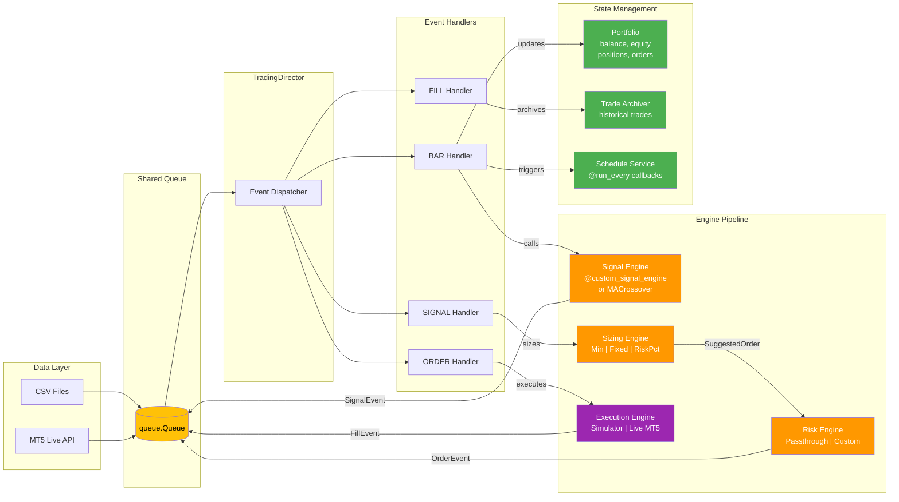
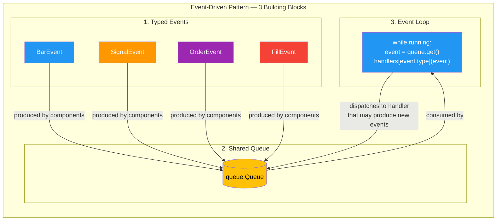
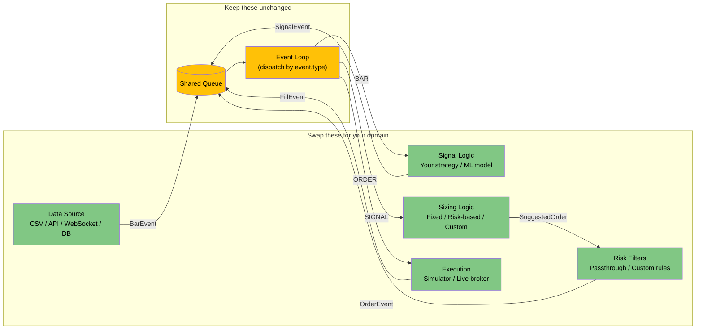
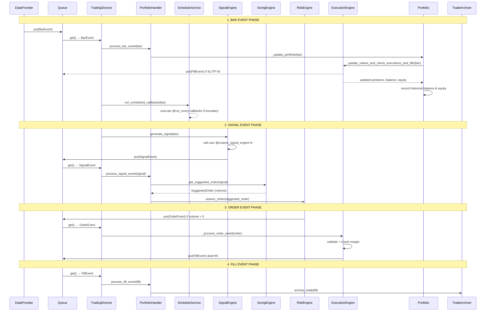
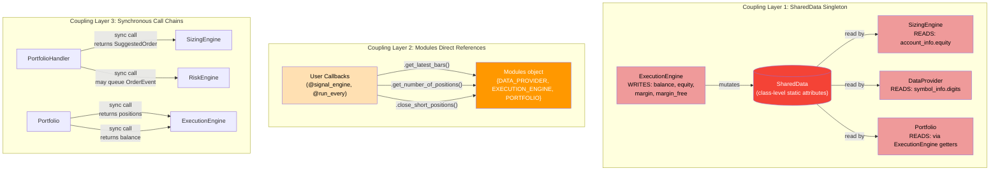
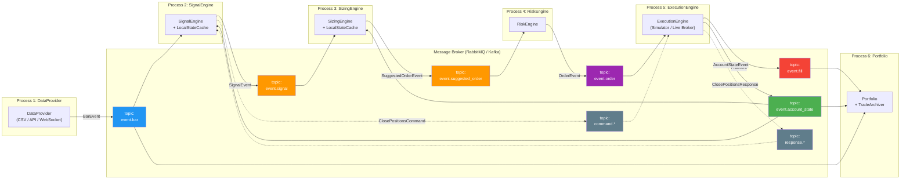
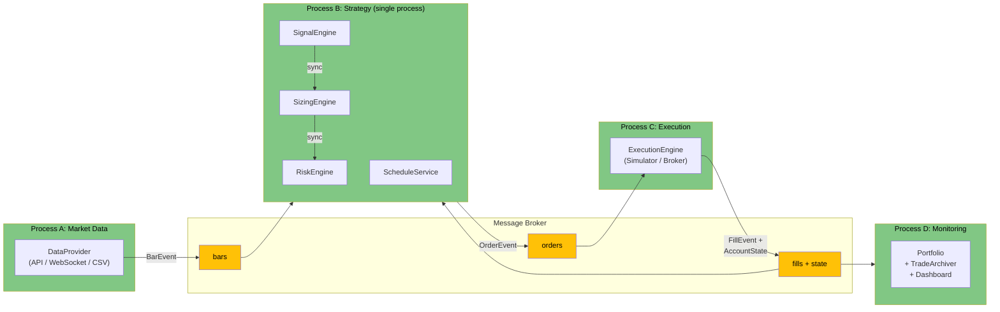
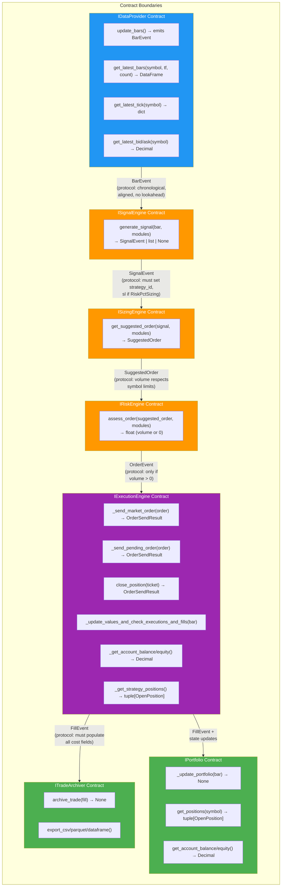
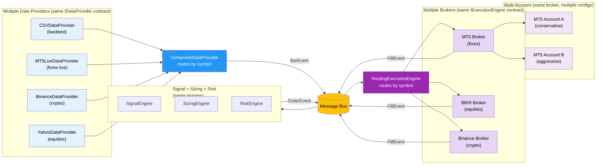

# PyEventBT — Event Flow Diagram

## Main Event Loop


## Live Bar Detection: How the System Knows a Candle Is Complete

In live mode, the system does **not** receive push notifications from MT5 when a new candle closes. Instead, it uses a **polling + timestamp comparison** strategy:

1. **Heartbeat polling** — `TradingDirector._run_live_trading()` runs an infinite loop. Each iteration sleeps for `heartbeat` seconds (configured via `MT5LiveSessionConfig`), then checks for new bars when the event queue is empty.

2. **Only closed bars** — `Mt5LiveDataProvider.get_latest_bar()` calls `mt5.copy_rates_from_pos(symbol, tf, from_pos=1, count=1)`. The `from_pos=1` parameter is the key: position `0` is the **currently forming** (incomplete) candle, position `1` is the most recently **closed** (complete) candle. The system never processes an incomplete bar.

3. **Datetime comparison** — `update_bars()` tracks the last seen bar datetime per symbol and timeframe in `last_bar_tf_datetime[symbol][timeframe]`. On each poll, it compares the returned bar's datetime against the stored value. If the new bar is newer, a `BarEvent` is emitted and the stored datetime is updated. If the datetime is the same, no new candle has closed yet and nothing happens.

```
Live polling timeline (heartbeat = 1s, timeframe = 1min):

 t=0s   poll → bar datetime = 10:01 → same as last seen → no event
 t=1s   poll → bar datetime = 10:01 → same → no event
 t=2s   poll → bar datetime = 10:01 → same → no event
  ...
 t=58s  poll → bar datetime = 10:01 → same → no event
 t=59s  poll → bar datetime = 10:02 → NEW! → emit BarEvent(10:02) → update last seen
 t=60s  poll → bar datetime = 10:02 → same → no event
  ...
```

**Latency implication:** The worst-case delay between a candle closing and the system detecting it is approximately equal to `heartbeat` seconds. A heartbeat of 1 second means the system detects new 1-minute bars within ~1 second of close.

## Simplified Event Pipeline



## Core Design Pattern (Portable)

The following diagram shows the minimal, reusable pattern that underlies the full system. Any project can adopt this architecture by implementing these three layers:



### Integration Points — What to Swap



## Event Lifecycle: Single Bar to Trade



## Architecture Limitations: Coupling Points

This diagram highlights the three coupling layers that prevent running components as independent processes.



## Distributed Migration: Target Architecture

How the same event flow looks when each component runs as a separate process with a message broker between them.



## Recommended Hybrid Architecture

A pragmatic middle ground: distribute only at genuine I/O boundaries, keep tight computation pipelines in one process.



## Component Contracts & Protocols

Each box is a **contract** (what the component must implement). Each arrow is a **protocol** (what message flows between them and what each side expects).



## Multi-Provider & Multi-Broker Patterns

How to extend the architecture with multiple data sources and brokers.


