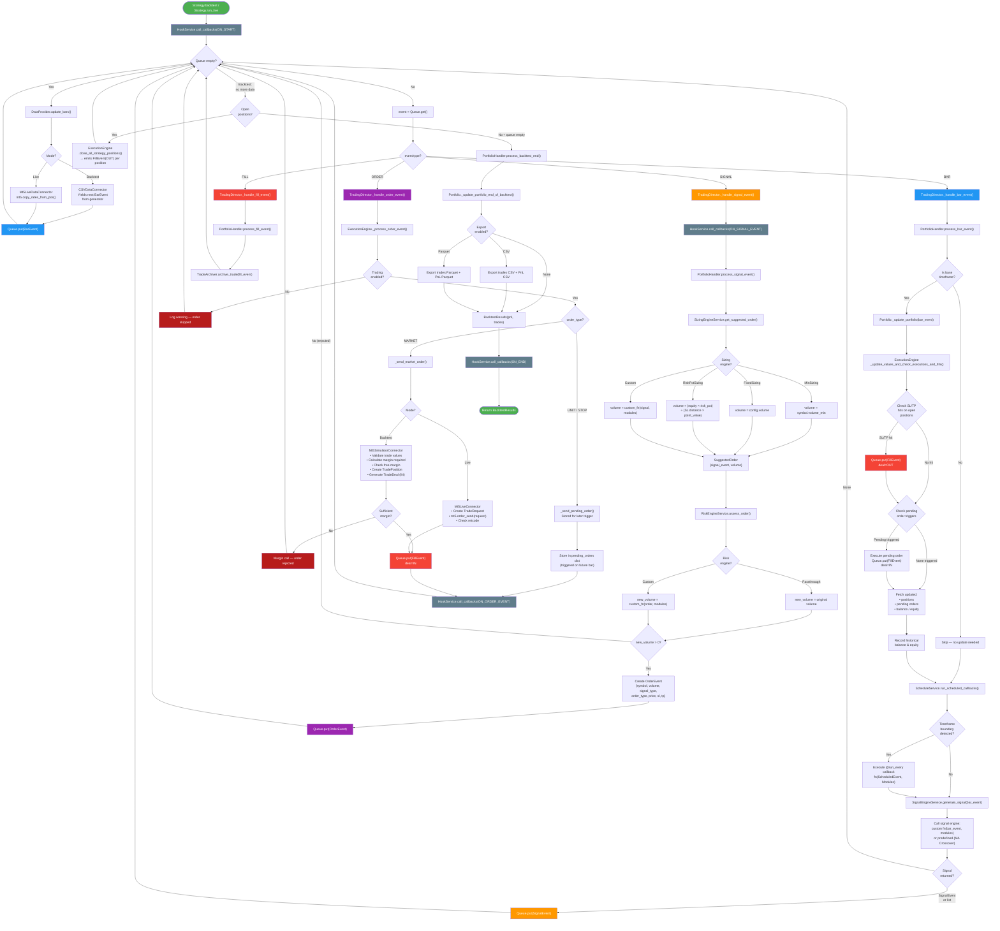
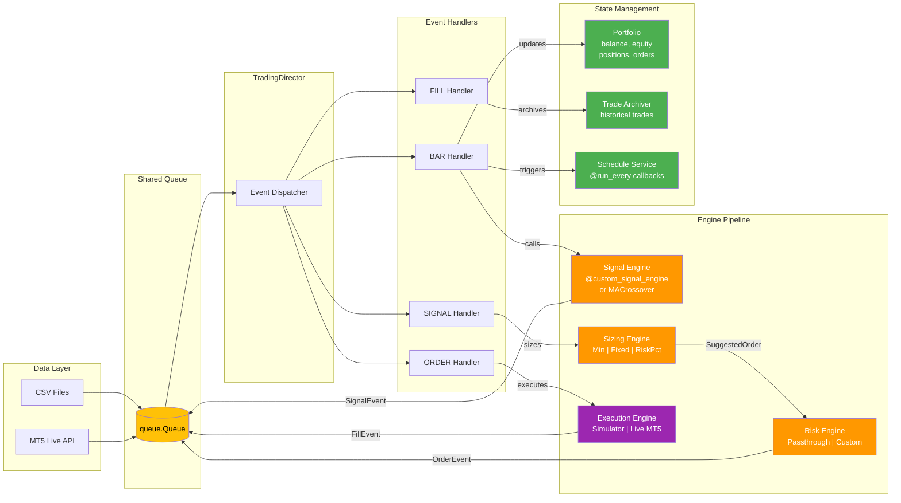
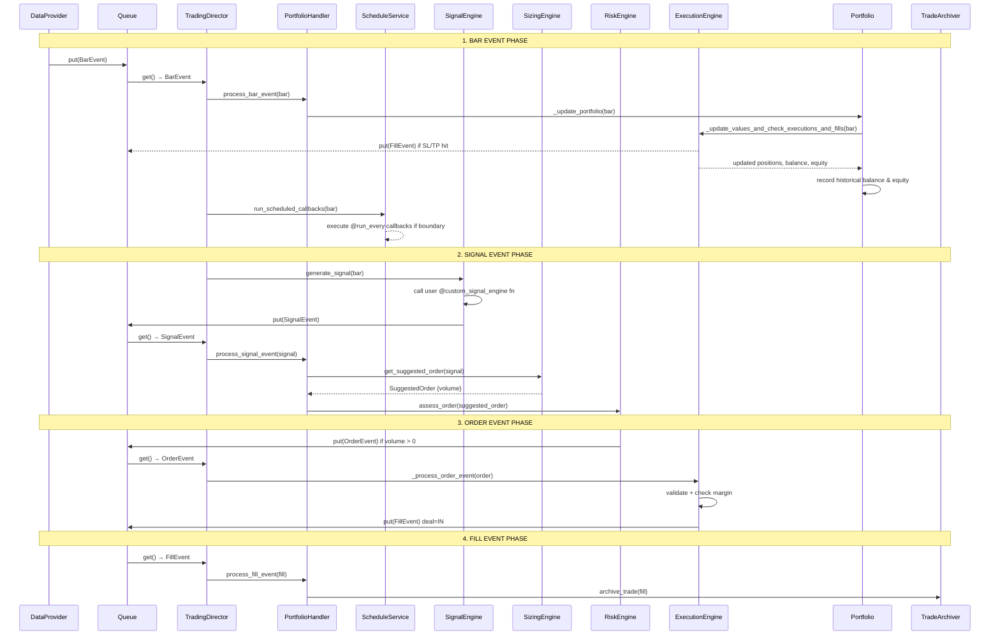

# PyEventBT — Event Flow Diagram

## Main Event Loop

```mermaid
flowchart TD
    START([Strategy.backtest / Strategy.run_live]) --> HOOK_START["HookService.call_callbacks(ON_START)"]
    HOOK_START --> LOOP_START{Queue empty?}

    %% ─── QUEUE EMPTY: FEED NEW BARS ───
    LOOP_START -- "Yes" --> UPDATE_BARS["DataProvider.update_bars()"]
    UPDATE_BARS --> CSV_OR_LIVE{Mode?}
    CSV_OR_LIVE -- "Backtest" --> CSV_GEN["CSVDataConnector\nYields next BarEvent\nfrom generator"]
    CSV_OR_LIVE -- "Live" --> MT5_FETCH["Mt5LiveDataConnector\nmt5.copy_rates_from_pos()"]
    CSV_GEN --> ENQUEUE_BAR["Queue.put(BarEvent)"]
    MT5_FETCH --> ENQUEUE_BAR
    ENQUEUE_BAR --> LOOP_START

    %% ─── QUEUE NOT EMPTY: DEQUEUE ───
    LOOP_START -- "No" --> DEQUEUE["event = Queue.get()"]
    DEQUEUE --> EVENT_TYPE{event.type?}

    %% ════════════════════════════════════════
    %% BAR EVENT
    %% ════════════════════════════════════════
    EVENT_TYPE -- "BAR" --> BAR_HANDLER["TradingDirector._handle_bar_event()"]
    BAR_HANDLER --> PH_BAR["PortfolioHandler.process_bar_event()"]

    PH_BAR --> IS_BASE_TF{Is base\ntimeframe?}
    IS_BASE_TF -- "No" --> SKIP_UPDATE[Skip — no update needed]
    SKIP_UPDATE --> SCHEDULE
    IS_BASE_TF -- "Yes" --> UPDATE_PORTFOLIO["Portfolio._update_portfolio(bar_event)"]

    UPDATE_PORTFOLIO --> EE_UPDATE["ExecutionEngine\n._update_values_and_check_executions_and_fills()"]
    EE_UPDATE --> CHECK_SLTP{"Check SL/TP\nhits on open\npositions"}
    CHECK_SLTP -- "SL/TP hit" --> EMIT_FILL_SLTP["Queue.put(FillEvent)\ndeal=OUT"]
    CHECK_SLTP -- "No hit" --> CHECK_PENDING{"Check pending\norder triggers"}
    EMIT_FILL_SLTP --> CHECK_PENDING
    CHECK_PENDING -- "Pending triggered" --> EXEC_PENDING["Execute pending order\nQueue.put(FillEvent)\ndeal=IN"]
    CHECK_PENDING -- "None triggered" --> FETCH_STATE["Fetch updated:\n• positions\n• pending orders\n• balance / equity"]
    EXEC_PENDING --> FETCH_STATE
    FETCH_STATE --> RECORD_HIST["Record historical\nbalance & equity"]
    RECORD_HIST --> SCHEDULE

    SCHEDULE["ScheduleService.run_scheduled_callbacks()"]
    SCHEDULE --> TF_BOUNDARY{Timeframe\nboundary\ndetected?}
    TF_BOUNDARY -- "Yes" --> EXEC_CALLBACK["Execute @run_every callback\nfn(ScheduledEvent, Modules)"]
    TF_BOUNDARY -- "No" --> SIGNAL_GEN
    EXEC_CALLBACK --> SIGNAL_GEN

    SIGNAL_GEN["SignalEngineService.generate_signal(bar_event)"]
    SIGNAL_GEN --> CALL_ENGINE["Call signal engine:\ncustom fn(bar_event, modules)\nor predefined (MA Crossover)"]
    CALL_ENGINE --> SIG_RESULT{Signal\nreturned?}
    SIG_RESULT -- "None" --> LOOP_START
    SIG_RESULT -- "SignalEvent\nor list" --> ENQUEUE_SIG["Queue.put(SignalEvent)"]
    ENQUEUE_SIG --> LOOP_START

    %% ════════════════════════════════════════
    %% SIGNAL EVENT
    %% ════════════════════════════════════════
    EVENT_TYPE -- "SIGNAL" --> SIG_HANDLER["TradingDirector._handle_signal_event()"]
    SIG_HANDLER --> HOOK_SIGNAL["HookService.call_callbacks(ON_SIGNAL_EVENT)"]
    HOOK_SIGNAL --> PH_SIGNAL["PortfolioHandler.process_signal_event()"]

    PH_SIGNAL --> SIZING["SizingEngineService.get_suggested_order()"]
    SIZING --> SIZING_TYPE{Sizing\nengine?}
    SIZING_TYPE -- "MinSizing" --> MIN_VOL["volume = symbol.volume_min"]
    SIZING_TYPE -- "FixedSizing" --> FIXED_VOL["volume = config.volume"]
    SIZING_TYPE -- "RiskPctSizing" --> RISK_VOL["volume = (equity × risk_pct)\n÷ (SL distance × point_value)"]
    SIZING_TYPE -- "Custom" --> CUSTOM_VOL["volume = custom_fn(signal, modules)"]
    MIN_VOL --> SUGGESTED["SuggestedOrder\n{signal_event, volume}"]
    FIXED_VOL --> SUGGESTED
    RISK_VOL --> SUGGESTED
    CUSTOM_VOL --> SUGGESTED

    SUGGESTED --> RISK["RiskEngineService.assess_order()"]
    RISK --> RISK_TYPE{Risk\nengine?}
    RISK_TYPE -- "Passthrough" --> PASS_VOL["new_volume = original volume"]
    RISK_TYPE -- "Custom" --> CUSTOM_RISK["new_volume = custom_fn(order, modules)"]
    PASS_VOL --> RISK_CHECK{new_volume > 0?}
    CUSTOM_RISK --> RISK_CHECK

    RISK_CHECK -- "Yes" --> CREATE_ORDER["Create OrderEvent\n{symbol, volume, signal_type,\norder_type, price, sl, tp}"]
    RISK_CHECK -- "No (rejected)" --> LOOP_START
    CREATE_ORDER --> ENQUEUE_ORDER["Queue.put(OrderEvent)"]
    ENQUEUE_ORDER --> LOOP_START

    %% ════════════════════════════════════════
    %% ORDER EVENT
    %% ════════════════════════════════════════
    EVENT_TYPE -- "ORDER" --> ORD_HANDLER["TradingDirector._handle_order_event()"]
    ORD_HANDLER --> EE_PROCESS["ExecutionEngine._process_order_event()"]

    EE_PROCESS --> TRADING_ENABLED{Trading\nenabled?}
    TRADING_ENABLED -- "No" --> WARN_DISABLED["Log warning — order skipped"]
    WARN_DISABLED --> LOOP_START
    TRADING_ENABLED -- "Yes" --> ORDER_TYPE{order_type?}

    ORDER_TYPE -- "MARKET" --> MARKET_EXEC["_send_market_order()"]
    ORDER_TYPE -- "LIMIT / STOP" --> PENDING_EXEC["_send_pending_order()\nStored for later trigger"]

    MARKET_EXEC --> EXEC_MODE{Mode?}
    EXEC_MODE -- "Backtest" --> SIM_MARKET["Mt5SimulatorConnector\n• Validate trade values\n• Calculate margin required\n• Check free margin\n• Create TradePosition\n• Generate TradeDeal (IN)"]
    EXEC_MODE -- "Live" --> LIVE_MARKET["Mt5LiveConnector\n• Create TradeRequest\n• mt5.order_send(request)\n• Check retcode"]

    SIM_MARKET --> MARGIN_CHECK{Sufficient\nmargin?}
    MARGIN_CHECK -- "No" --> MARGIN_CALL["Margin call — order rejected"]
    MARGIN_CALL --> LOOP_START
    MARGIN_CHECK -- "Yes" --> EMIT_FILL_IN["Queue.put(FillEvent)\ndeal=IN"]
    LIVE_MARKET --> EMIT_FILL_IN
    PENDING_EXEC --> STORE_PENDING["Store in pending_orders dict\n(triggered on future bar)"]
    STORE_PENDING --> HOOK_ORDER
    EMIT_FILL_IN --> HOOK_ORDER

    HOOK_ORDER["HookService.call_callbacks(ON_ORDER_EVENT)"]
    HOOK_ORDER --> LOOP_START

    %% ════════════════════════════════════════
    %% FILL EVENT
    %% ════════════════════════════════════════
    EVENT_TYPE -- "FILL" --> FILL_HANDLER["TradingDirector._handle_fill_event()"]
    FILL_HANDLER --> PH_FILL["PortfolioHandler.process_fill_event()"]
    PH_FILL --> ARCHIVE["TradeArchiver.archive_trade(fill_event)"]
    ARCHIVE --> LOOP_START

    %% ════════════════════════════════════════
    %% END OF DATA
    %% ════════════════════════════════════════
    LOOP_START -- "Backtest:\nno more data" --> END_CHECK{Open\npositions?}
    END_CHECK -- "Yes" --> CLOSE_ALL["ExecutionEngine\n.close_all_strategy_positions()\n→ emits FillEvent(OUT) per position"]
    CLOSE_ALL --> LOOP_START
    END_CHECK -- "No + queue empty" --> BT_END["PortfolioHandler.process_backtest_end()"]
    BT_END --> FINAL_UPDATE["Portfolio._update_portfolio_end_of_backtest()"]
    FINAL_UPDATE --> EXPORT{Export\nenabled?}
    EXPORT -- "CSV" --> EXPORT_CSV["Export trades CSV + PnL CSV"]
    EXPORT -- "Parquet" --> EXPORT_PQ["Export trades Parquet + PnL Parquet"]
    EXPORT -- "None" --> BUILD_RESULTS
    EXPORT_CSV --> BUILD_RESULTS
    EXPORT_PQ --> BUILD_RESULTS
    BUILD_RESULTS["BacktestResults(pnl, trades)"]
    BUILD_RESULTS --> HOOK_END["HookService.call_callbacks(ON_END)"]
    HOOK_END --> RETURN([Return BacktestResults])

    %% ─── STYLING ───
    style START fill:#4CAF50,color:#fff
    style RETURN fill:#4CAF50,color:#fff
    style BAR_HANDLER fill:#2196F3,color:#fff
    style SIG_HANDLER fill:#FF9800,color:#fff
    style ORD_HANDLER fill:#9C27B0,color:#fff
    style FILL_HANDLER fill:#F44336,color:#fff
    style ENQUEUE_BAR fill:#2196F3,color:#fff
    style ENQUEUE_SIG fill:#FF9800,color:#fff
    style ENQUEUE_ORDER fill:#9C27B0,color:#fff
    style EMIT_FILL_IN fill:#F44336,color:#fff
    style EMIT_FILL_SLTP fill:#F44336,color:#fff
    style HOOK_START fill:#607D8B,color:#fff
    style HOOK_SIGNAL fill:#607D8B,color:#fff
    style HOOK_ORDER fill:#607D8B,color:#fff
    style HOOK_END fill:#607D8B,color:#fff
    style MARGIN_CALL fill:#b71c1c,color:#fff
    style WARN_DISABLED fill:#b71c1c,color:#fff
```

## Simplified Event Pipeline

```mermaid
flowchart LR
    subgraph DataLayer["Data Layer"]
        CSV["CSV Files"]
        MT5_DATA["MT5 Live API"]
    end

    subgraph EventBus["Shared Queue"]
        Q[("queue.Queue")]
    end

    subgraph EventLoop["TradingDirector"]
        direction TB
        DISPATCH["Event Dispatcher"]
    end

    subgraph Handlers["Event Handlers"]
        direction TB
        BAR_H["BAR Handler"]
        SIG_H["SIGNAL Handler"]
        ORD_H["ORDER Handler"]
        FILL_H["FILL Handler"]
    end

    subgraph Engines["Engine Pipeline"]
        direction TB
        SIGNAL_E["Signal Engine\n@custom_signal_engine\nor MACrossover"]
        SIZING_E["Sizing Engine\nMin | Fixed | RiskPct"]
        RISK_E["Risk Engine\nPassthrough | Custom"]
        EXEC_E["Execution Engine\nSimulator | Live MT5"]
    end

    subgraph State["State Management"]
        direction TB
        PORTFOLIO["Portfolio\nbalance, equity\npositions, orders"]
        ARCHIVER["Trade Archiver\nhistorical trades"]
        SCHEDULE["Schedule Service\n@run_every callbacks"]
    end

    CSV --> Q
    MT5_DATA --> Q

    Q --> DISPATCH
    DISPATCH --> BAR_H
    DISPATCH --> SIG_H
    DISPATCH --> ORD_H
    DISPATCH --> FILL_H

    BAR_H -->|"updates"| PORTFOLIO
    BAR_H -->|"triggers"| SCHEDULE
    BAR_H -->|"calls"| SIGNAL_E
    SIGNAL_E -->|"SignalEvent"| Q

    SIG_H -->|"sizes"| SIZING_E
    SIZING_E -->|"SuggestedOrder"| RISK_E
    RISK_E -->|"OrderEvent"| Q

    ORD_H -->|"executes"| EXEC_E
    EXEC_E -->|"FillEvent"| Q

    FILL_H -->|"archives"| ARCHIVER

    style Q fill:#FFC107,color:#000
    style SIGNAL_E fill:#FF9800,color:#fff
    style SIZING_E fill:#FF9800,color:#fff
    style RISK_E fill:#FF9800,color:#fff
    style EXEC_E fill:#9C27B0,color:#fff
    style PORTFOLIO fill:#4CAF50,color:#fff
    style ARCHIVER fill:#4CAF50,color:#fff
    style SCHEDULE fill:#4CAF50,color:#fff
```

## Event Lifecycle: Single Bar to Trade

```mermaid
sequenceDiagram
    participant DP as DataProvider
    participant Q as Queue
    participant TD as TradingDirector
    participant PH as PortfolioHandler
    participant SS as ScheduleService
    participant SE as SignalEngine
    participant SZ as SizingEngine
    participant RE as RiskEngine
    participant EE as ExecutionEngine
    participant P as Portfolio
    participant TA as TradeArchiver

    Note over DP,TA: 1. BAR EVENT PHASE
    DP->>Q: put(BarEvent)
    Q->>TD: get() → BarEvent
    TD->>PH: process_bar_event(bar)
    PH->>P: _update_portfolio(bar)
    P->>EE: _update_values_and_check_executions_and_fills(bar)
    EE-->>Q: put(FillEvent) if SL/TP hit
    EE-->>P: updated positions, balance, equity
    P->>P: record historical balance & equity
    TD->>SS: run_scheduled_callbacks(bar)
    SS-->>SS: execute @run_every callbacks if boundary

    Note over DP,TA: 2. SIGNAL EVENT PHASE
    TD->>SE: generate_signal(bar)
    SE->>SE: call user @custom_signal_engine fn
    SE->>Q: put(SignalEvent)
    Q->>TD: get() → SignalEvent
    TD->>PH: process_signal_event(signal)
    PH->>SZ: get_suggested_order(signal)
    SZ-->>PH: SuggestedOrder {volume}
    PH->>RE: assess_order(suggested_order)

    Note over DP,TA: 3. ORDER EVENT PHASE
    RE->>Q: put(OrderEvent) if volume > 0
    Q->>TD: get() → OrderEvent
    TD->>EE: _process_order_event(order)
    EE->>EE: validate + check margin
    EE->>Q: put(FillEvent) deal=IN

    Note over DP,TA: 4. FILL EVENT PHASE
    Q->>TD: get() → FillEvent
    TD->>PH: process_fill_event(fill)
    PH->>TA: archive_trade(fill)
```
